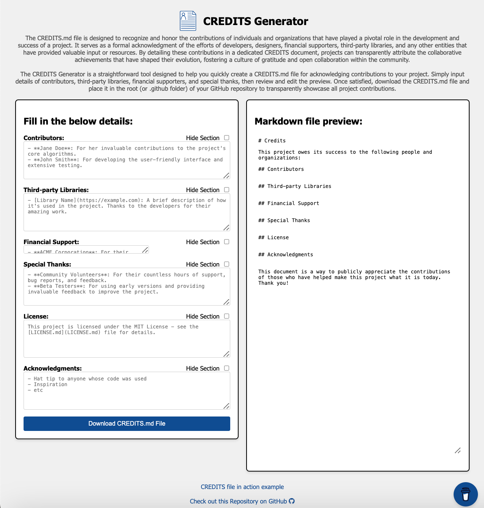

<!-- Begin README -->

<div align="center">
    <a href="https://scottgriv.github.io/Binary-Converter" target="_blank">
        
    </a>
</div>
<br>
<p align="center">
    <a href="https://svelte.dev/"></a>
    <a href="https://nodejs.org/en/"></a>
    <br>
    <a href="https://github.com/scottgriv"></a>
    <a href="mailto:scott.grivner@gmail.com"></a>
    <a href="https://www.buymeacoffee.com/scottgriv"></a>
    <br>
    <a href="https://github.com/scottgriv/CREDITS-Generator/actions/workflows/gh-pages.yml" target="_blank"></a>
    <a href="https://prgportfolio.com" target="_blank"></a>
</p>

---------------

<h1 align="center">📄 CREDITS Generator</h1>

The `CREDITS.md` file is designed to recognize and honor the contributions of individuals and organizations that have played a pivotal role in the development and success of a project. It serves as a formal acknowledgment of the efforts of developers, designers, financial supporters, third-party libraries, and any other entities that have provided valuable input or resources. By detailing these contributions in a dedicated `CREDITS.md` document, projects can transparently attribute the collaborative achievements that have shaped their evolution, fostering a culture of gratitude and open collaboration within the community.

The **CREDITS Generator** is a straightforward tool designed to help you quickly create a `CREDITS.md` file for acknowledging contributions to your project. Simply input details of contributors, third-party libraries, financial supporters, and special thanks, then review or edit the preview. Once satisfied, download the `CREDITS.md` file and place it in the root (or .github folder) of your GitHub repository to transparently showcase all project contributions.
- Built using **SvelteKit**.
- View a demo of the project on GitHub Pages **[Here](https://scottgriv.github.io/CREDITS-Generator)**.

<div align="center">
    <a href="https://scottgriv.github.io/CREDITS-Generator" target="_blank">
        
    </a>
    <br>
    <i>Application Preview</i>
</div>

---------------

## Table of Contents

- [Background Story](#background-story)
- [How this Works](#how-this-works)
- [Getting Started](#getting-started)
- [Resources](#resources)
- [License](#license)
- [Credits](#credits)

## Background Story

I wanted a quick and easy way to generate a `CREDITS.md` file for my GitHub projects, without having to paste a template over and over again; I couldn't find a generator online, so I built my own!

Feel free to fork and contribute!

## How this Works

1. Visit the website, and enter the relevant information.
2. Click "Download CREDITS.md File" to your local.
3. Place the markdown file in the root (or .github folder) or `docs` folder of your repository.

> [!NOTE]
> `CREDITS.md` is a special file used in GitHub repositories.
> It is comparable to `AUTHORS`, `CONTRIBUTORS`, and `ACKNOWLEDGMENTS` files.
> It is useful for [GNU License Purposes](https://www.gnu.org/prep/maintain/html_node/Recording-Contributors.html)

## Getting Started

If you want to download a copy of this application:

1. Clone the repo to your local.
2. In a terminal, point towards the root of this application.
3. Build the application:

```shell
npm run build
```

4. Run the application:

```shell
npm run dev
```

5. Visit the website on your localhost, i.e. http://localhost:5173/CREDITS-Generator.
6. Follow the instructions above in [How this Works](#how-this-works) to generate your `CREDITS.md` file.

## Resources

- [Example Credits File # 1](https://github.com/scottgriv/PRG-Personal-Repository-Guidelines/blob/ece049c6078b20d605913ee8603c229239ef4ef9/.github/CREDITS.md) - Example of a `CREDITS.md` file generated by this application for another project of mine.
- [Example Credits File # 2](https://github.com/10up/Open-Source-Best-Practices/blob/gh-pages/CREDITS.md) - General example of a `CREDITS.md` file used for an unaffiliated project.
- [Basic Markdown Syntax](https://www.markdownguide.org/basic-syntax/) - This generator follows the recommended basic markdown syntax. Read more about it here.
- [Svelte](https://svelte.dev/) - The official Svelte website.
- [Node.js](https://nodejs.org/en/) - Node.js is a JavaScript runtime built on Chrome's V8 JavaScript engine (used by Svelte for development).
- [Rollup](https://rollupjs.org) - Rollup is a module bundler for JavaScript which compiles small pieces of code into something larger and more complex, such as a library or application (used by Svelte for building).
- [degit](https://github.com/Rich-Harris/degit) - degit is a scaffolding tool that allows you to clone a git repository without the entire git history (used by Svelte for project creation).
- [sirv](https://github.com/lukeed/sirv) - sirv is a lightweight server that allows you to serve static files (used by Svelte for development).
- [Visual Studio Code](https://code.visualstudio.com/) - VS Code is a free code editor from Microsoft.
- [Svelte for VS Code](https://marketplace.visualstudio.com/items?itemName=svelte.svelte-vscode) - Svelte for VS Code is an extension that provides syntax highlighting, code completion, and other features for Svelte.
- [SvelteKit](https://kit.svelte.dev/) - SvelteKit is a framework for building web applications of all sizes, with a beautiful development experience and flexible filesystem-based routing.
- [SvelteFire](https://github.com/codediodeio/sveltefire) - SvelteFire is a collection of official Svelte bindings for Firebase. It includes bindings for Firebase Authentication, Cloud Firestore, Realtime Database, Storage, and Cloud Messaging. It also includes a collection of utilities for working with Firebase and Svelte.

## License

This project is released under the terms of the **MIT License**, which permits use, modification, and distribution of the code, subject to the conditions outlined in the license.
- The [MIT License](https://choosealicense.com/licenses/mit/) provides certain freedoms while preserving rights of attribution to the original creators.
- For more details, see the [LICENSE](LICENSE) file in this repository. in this repository.

## Credits

**Author:** [Scott Grivner](https://github.com/scottgriv) <br>
**Email:** [scott.grivner@gmail.com](mailto:scott.grivner@gmail.com) <br>
**Website:** [scottgrivner.dev](https://www.scottgrivner.dev) <br>
**Reference:** [Main Branch](https://github.com/scottgriv/CREDITS-Generator) <br>

---------------

<div align="center">
    <a href="https://scottgrivner.dev" target="_blank">
        
    </a>
</div>

<!-- End README -->
